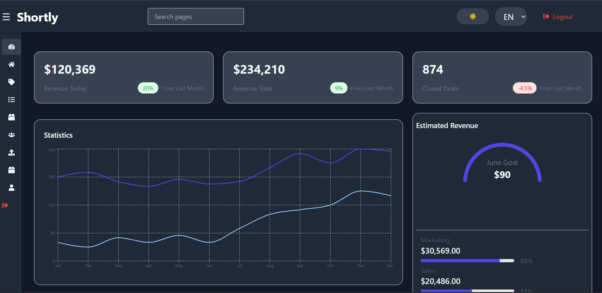
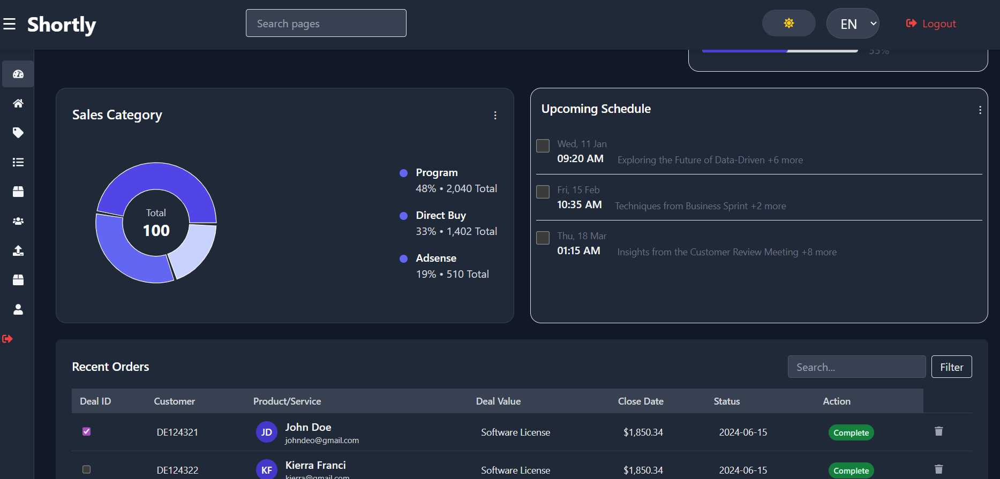
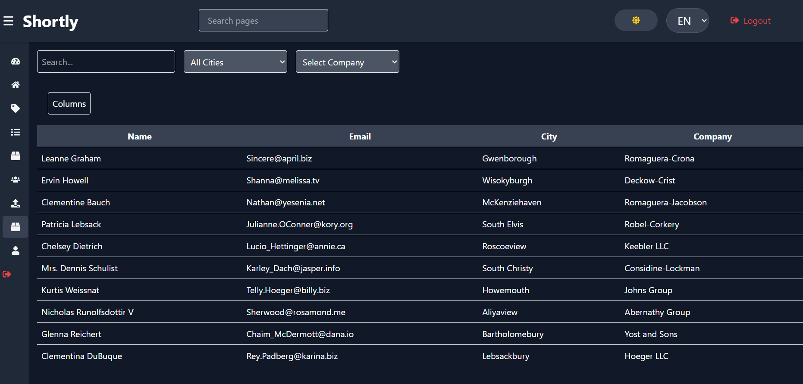
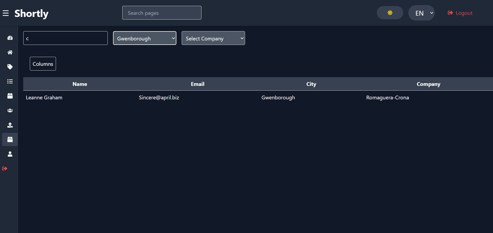
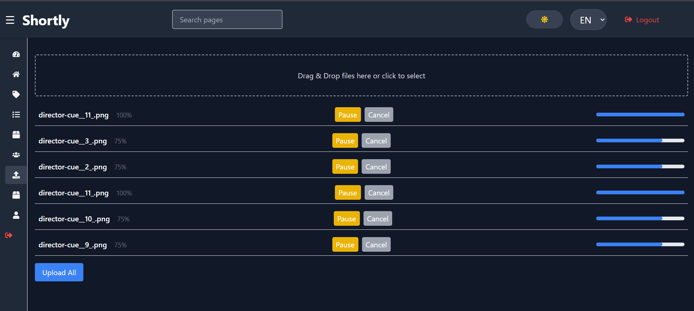
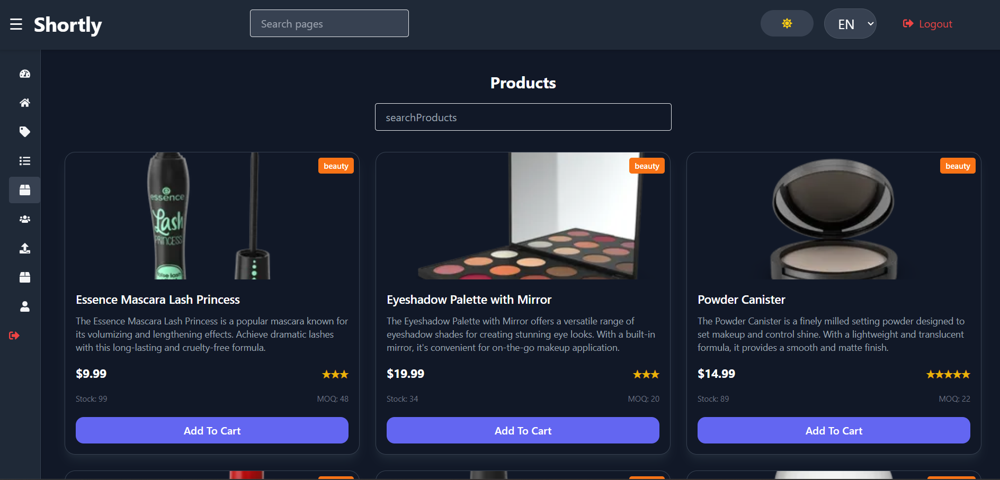
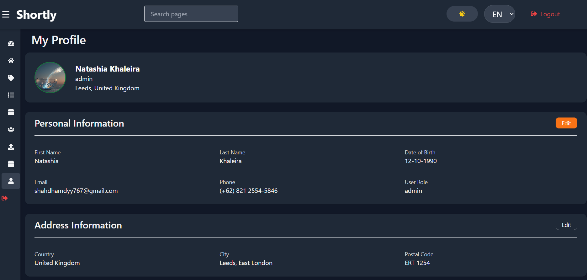
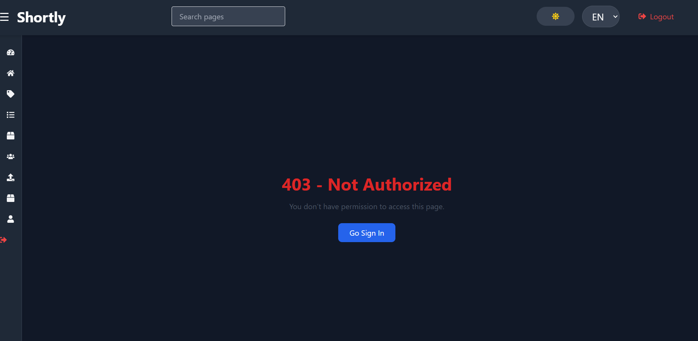
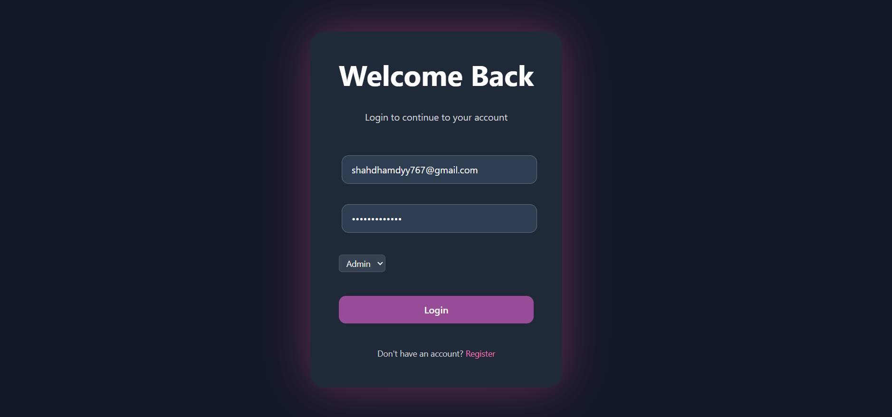
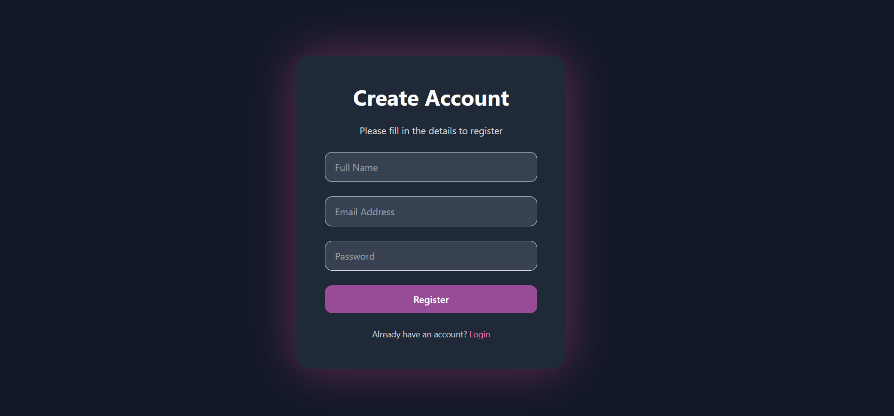

#  Frontend Dashboard & Tasks  

## Overview
This project is a collection of real-world frontend tasks and UI features built with React.  
It demonstrates practical implementation of authentication flows, performance optimization, API handling, and modern UI/UX patterns.

The project is not a single-purpose application, but a showcase of features commonly used in production-level systems.

---

## Key Features

### General
- Fully responsive design (Mobile, Tablet, Desktop)
- Dark / Light mode support
- Multi-language support (i18n)

---

## 📁 Project Structure

- assets/
- components/
- pages/
- constants/
- context/
- routes/
- hooks/
- services/

---

### Layout & Navigation
- Responsive layout structure
- Desktop Sidebar & Mobile Sidebar
- Navigation Bar (Navbar)
- Footer with multi-section links
- Structured routing between pages

---

### Authentication & Security
- Login & Register pages
- Protected Routes (role-based: User / Admin)
- Token-based authentication
- Automatic logout when token expires
- Refresh Token handling
- Redirect to login on unauthorized access
- Not Found (404) page

---

### API Handling & UX
- Global API handling using Axios interceptors
- Global loading indicator for all API requests
- Centralized error handling
- Optimized API calls and caching

---

### URL Shortener (Home & Pricing)
- Shorten URLs using API
- Display and manage shortened links

---

### Posts Module
- Fetch data from external JSON API
- Group posts by users
- Edit posts (online & offline)
- LocalStorage caching
- Fetch once & reuse data
- Hover-based prefetching

---

### Products Page
- Data fetched from external API
- Infinite scroll (lazy loading)
- Search & filtering

---

### Users Page
- Data fetched from external API
- Pagination system

---

### Advanced Users Table
- Filter by company & city
- Dynamic column visibility (show/hide columns)
- Customizable table view

---

### Dashboard
- Data visualization using charts (Recharts)
- Display analytics and insights
- Interactive UI components

---

### File Upload System
- Multi-file upload
- Chunk upload simulation (without real API)
- File type validation (images, PDFs only)
- Preview before upload
- Upload controls:
  - Pause
  - Resume
  - Cancel
  - Delete

---

### User Profile
- Update user data using global state
- Profile image upload

---

## UI / UX Enhancements
- Smooth animations using Framer Motion
- Skeleton loading states
- Hover interactions for better UX
- Improved async handling experience

---

## Tech Stack & Concepts

- React.js
- React Router
- Tailwind CSS

- TanStack React Query  
  (Data fetching, caching, and performance optimization)

- Axios  
  (Interceptors, global loading & error handling)

- Context API  
  (Global state management)

- Framer Motion  
  (Animations & transitions)

- Recharts  
  (Charts and data visualization)

- i18next  
  (Multi-language support)

- LocalStorage  
  (Caching & offline support)

- Protected Routes (Role-based access)
- Refresh Token Strategy
- API Interceptors
- Global Error & Loading Handling
- Lazy Loading & Infinite Scroll
- File Upload (Chunk simulation)

---

## What This Project Demonstrates
- Real-world authentication flows
- Role-based access control
- Efficient API and state management
- Performance optimization techniques
- Scalable frontend architecture
- Enhanced UX with animations and loading strategies

---

## Screenshots

### Home Page

### Dashboard

###  Users Table

### File Upload

### Products

### Profile

### NotAuthorized

### Login & Register

## Live Demo
  https://frontend-tasks-alpha.vercel.app/

---

##  Note
This project simulates real-world frontend tasks and production-like scenarios using public and mock APIs.